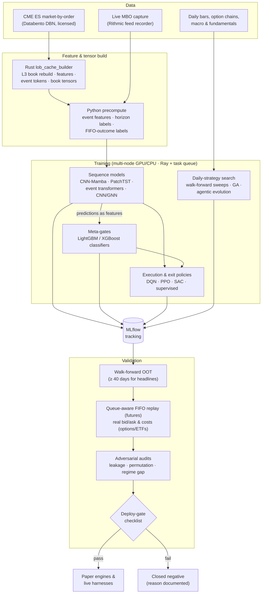

# Lvl3Quant

**Quantitative ML research on Level-3 order-book data, execution, and systematic strategies**

Lvl3Quant is the codebase from an independent quant research program that ran from March to September 2026. It started with deep learning on CME E-mini S&P 500 (ES) market-by-order (MBO, or Level 3) data. The pipeline rebuilds the full limit order book event by event and trains sequence models to predict price moves over the next second to 30 seconds. The program then widened to execution and exit-policy learning, options income, daily ETF and macro strategies, and prediction markets. Validation came first throughout: walk-forward out-of-time (OOT) testing, queue-aware fill simulation with real costs, adversarial self-audits, and explicit deploy gates. Most ideas failed those gates. The repository keeps each failure and the reason for it next to the few ideas that survived. An autonomous Claude-based research agent ran the program day to day under the author's direction (see [Built with AI agents](#built-with-ai-agents)).

---

## Highlights

- **Level-3 order-book modeling.** About 248 trading days of ES MBO data (Jul 2025 to Apr 2026), with roughly 15–19M raw book events per day, are turned into event-level training windows, for example 3,000 events × 25 engineered microstructure features.
- **Model families.** CNN-Mamba selective state-space models (v2 through v3.x; later versions add multi-head outputs that predict realized FIFO (first-in, first-out queue) trade outcomes directly), PatchTST, event transformers, temporal/spatial CNNs and a GNN over order-book tensors, Hawkes-process, TFT and LSTM baselines. LightGBM/XGBoost classifiers act as meta-gates on the deep models' outputs.
- **Rust data engine.** `rust_cache_builder/` is an ~8k-line crate built on `dbn` and `rayon`. It rebuilds the Level-3 book in parallel from Databento DBN files. It writes snapshot caches, tokenized event sequences for transformers, 20×4 book tensors for spatial CNNs, and a 290-feature expansion. It also includes an event-level FIFO fill simulator.
- **Execution realism.** In the queue-aware FIFO market replay, a simulated order joins the rebuilt book at the back of its price level. It fills only after the orders ahead of it trade or cancel. Every ES trade pays a fixed 0.376-tick round-trip commission. RL agents (split-DQN, PPO, SAC) and supervised entry/exit models were trained and graded against this replay.
- **Validation discipline.** The rules are written down as numbered "hard constraints":
  - sliding walk-forward, with normalization statistics fitted on the training fold only
  - at least 40 out-of-time days behind any headline number
  - regime-gap and permutation tests
  - six-point adversarial audits
  - lockbox windows
  - pass/fail gates for each strategy written before its results were computed
- **Distributed compute.** A small multi-node home cluster: GPU nodes with an RTX 3090 and an RTX 3070, plus Linux CPU nodes. Ray ran some of the distributed GPU jobs, a persistent task queue and watchdogs handled dispatch, and a self-hosted MLflow server tracked experiments.
- **Documented negatives.** By the August 2026 run-history consolidation, about 200 experiments had been logged: 37 passed validation and 153 were closed as dead or rejected, each with a written reason.
- **Agentic strategy search.** The loop is modeled on NVIDIA's AVO (agentic variation operators) approach to evolutionary search: an LLM agent proposes changes to strategy code. Each version is scored by the geometric mean of its per-fold out-of-sample Sharpe, and a final lockbox window is scored only once.

---

## Architecture

---

## Research areas

**1. High-frequency futures microstructure alpha (ES MBO).**
The models predict direction over the next 1–30 seconds from raw book events, and whether a trade hits its take-profit before its stop-loss. The work went from CNN-Mamba v2 to v3.x, which added direct FIFO-outcome targets and a book-shape trunk. It also included a bake-off of four-branch CNN + PatchTST + Mamba fusion designs and tree meta-gates trained on model outputs. After the cost analysis parked the ES taker path, the same stack was pointed at SPY.
`alpha_discovery/deep_models/` · `alpha_discovery/features/` · `rust_cache_builder/` · `experiments/` · `scripts/v3_3_research/` · `scripts/v3_4_research/` · `docs/` (model specs) · `feeds/`

**2. RL/ML execution and exit policies.**
Given a signal, these models decide how to enter (limit or market order, and whether to chase the price) and when to exit. They include a Gymnasium FIFO environment with split-DQN (separate entry, cancel and exit heads), PPO and SAC agents. Supervised fill-probability, MFE/MAE (maximum favorable/adverse excursion) and first-passage models, plus adaptive take-profit/stop-loss (TP/SL) sweeps, sit alongside them. Everything is graded on the canonical FIFO replay.
`alpha_discovery/execution/` · `execution/` · `scripts/smart_exec/` · `scripts/rl_smart_exec/` · `scripts/adaptive_exit_v1/` · `scripts/direct_firstpassage/` · `scripts/exec_science/`

**3. Options income, the wheel, and the volatility risk premium.**
A wheel strategy (cash-secured puts, then covered calls) optimized with a genetic algorithm (GA) builds a Pareto front over yield, drawdown and assignment rate and was later re-tested on real option chains. Related studies cover bull-put spreads, iron condors, earnings volatility and the index variance premium. Each compares Black-Scholes pricing with real bid/ask pricing.
`wheel_strategy_v1/` · `scripts/income_research/` · `scripts/wheel_v6/` · `research/wheel_optimization/` · `strategy/earnings_vrp_v1.py` · `strategy/index_vrp_v1.py`

**4. Equity and ETF systematic strategies.**
These are daily and weekly strategies: sector rotation, volatility-gated leveraged growth, panic and mean-reversion signals, cross-asset momentum, and post-earnings drift. They include agent-evolved strategies validated on a held-out lockbox year, plus paper engines for the survivors.
`strategies/` · `strategy/` · `growth/` · `scripts/growth_research*/` · `research/` · `paper_engines/` · `validation/`

**5. Prediction markets.**
Tooling includes Kalshi and Polymarket clients and an edge detector (momentum, mean reversion, volume anomalies, LLM fair-value comparison). There is also a cross-platform arbitrage scan and a backtester that replays real historical trades. The backtester's fill assumptions are conservative: taker fills at the ask, an adverse-selection haircut, and exchange fees. This area was exploratory, and no validated edge is claimed.
`prediction_markets/`

**6. Macro.**
A GA-driven macro-exposure strategy goes long, flat or short broad ETFs based on VIX term structure, breadth, the yield curve, the dollar and sentiment. Related work covers a macro-regime classifier with rotation, and carry and cross-asset trend studies.
`macro_exposure_v1/` · `strategy/macro_regime/` · `strategy/crypto_funding_v1.py` · `strategy/tsmom_etf_v1.py`

---

## Repository map

| Path | Contents |
|---|---|
| `alpha_discovery/` | Core ES research: deep sequence models, feature builders, FIFO market replay, execution/RL agents, evaluation panels |
| `analysis/` | Prediction-analysis toolkit: exploitability, signal decay, regime conditioning, MFE/MAE |
| `backtests/` | Small standalone equity/sector backtests |
| `config/`, `configs/` | Strategy and paper-trading configs, saved winning configs |
| `constants.py`, `cost_constants_spy.py` | Shared constants and the SPY cost model |
| `docs/` | Model specs, design memos and audits (`docs/research/`), plus the agent's working journal (`docs/journal/`) |
| `engines/` | Market-hours scanners, position monitors and dashboards for the options sleeve |
| `execution/` | Execution-engine experiments; TP/SL, time-of-day and decision-tree sweeps |
| `experiments/` | Confluence meta-models, conformal wrappers, fill predictors, exit/hold studies |
| `feeds/` | Data-feed adapters (SPY via Databento and Alpaca) |
| `growth/` | Momentum, factor and trend scanners; income + growth portfolio optimizer |
| `infra/` | GPU auto-dispatcher, durable watchdog, edge validator, SQLite task queue, agent self-audit |
| `knowledge_base/` | Reference notes (option liquidity, sector-rotation summary) |
| `lib/` | Shared exit rules and position manager |
| `live_trading/` | Early live/paper engine: data-feed abstraction, inference, fill simulator, leakage audit |
| `live_trading_linux/` | Live MBO recorder, streaming features, model inference, paper traders, risk manager, watchdogs |
| `macro_exposure_v1/` | GA macro-exposure strategy (ingest → backtest → GA → report) |
| `ops/` | Job launchers, node-side queue puller, alerting |
| `output/` | Research reports (markdown) and small result summaries |
| `paper_engines/` | Per-strategy paper-trading engines and signal aggregators |
| `prediction_markets/` | Kalshi/Polymarket tooling and backtests |
| `reports/` | Diagnostic deep dives (label audits, long/short asymmetry) |
| `research/` | Daily-frequency strategy studies, sweeps, adversarial audits, `QUANT_KNOWLEDGE_BASE.md` |
| `rust_cache_builder/` | Rust crate: order-book rebuild, feature/tensor caches, FIFO fill simulator |
| `scripts/` | Most of the experiment drivers (~2,100 files), grouped by study |
| `strategies/` | Final versions of agent-evolved strategies, adversarial re-checks, and related backtests |
| `strategy/` | Pre-registered strategy studies; macro and sector pickers |
| `staging/`, `scratch/`, `skills_addendum/` | Pre-promotion inference code, throwaway experiments, an agent procedure note |
| `utils/` | Training watchdogs, retrain and cluster-monitor scripts |
| `validation/` | 2026 out-of-sample validations and the adversarial bias-audit report |
| `wheel_strategy_v1/` | GA-optimized wheel / options-income backtester and paper engine |

**Where to start reading:**
- [`docs/research/STRATEGY_2026-05-28.md`](docs/research/STRATEGY_2026-05-28.md): an honest scorecard after three months of ES research.
- [`docs/research/CNN_MAMBA_V3_SPEC.md`](docs/research/CNN_MAMBA_V3_SPEC.md): the model specification.
- [`docs/research/HC290D_QUEUE_AWARE_FIFO_AUDIT.md`](docs/research/HC290D_QUEUE_AWARE_FIFO_AUDIT.md): the fill-simulation audit.
- [`docs/research/STRATEGY_CATALOG.md`](docs/research/STRATEGY_CATALOG.md): what worked and what did not in daily strategies.
- [`docs/journal/`](docs/journal/): the process record.

---

## Methodology and rigor

**Walk-forward and out-of-time testing.**
- Models are trained on sliding windows and scored only on later, unseen dates. CNN-Mamba v3, for example, used 60 trading days of training followed by 5 out-of-time days, repeated over 10 folds.
- Per-feature normalization statistics are fitted on the training fold only and saved with the weights, so the same statistics are used at inference.
- Daily models typically use purge and embargo gaps between training and test data.
- Headline numbers need at least 40 out-of-time days. The record shows why: one model's 5-day information coefficient (IC, the correlation between predicted and realized returns) fell from 0.26 to 0.18 over 17 days, and its MFE/MAE correlations fell by more than 90% (`docs/v3_4_dual_cnn_mamba_spec.md`).

**Cost and fill modeling.**
- ES uses a fixed 0.376-tick round trip ($4.70 against a $12.50 tick).
- Passive orders go through the queue-aware FIFO replay:
  - the simulated order joins the rebuilt book at the back of its price level
  - it fills only after the queue ahead of it is consumed
  - repricing (chasing the price) puts the order back at the end of the queue
  - market orders cross the spread
- The audit in `docs/research/HC290D_QUEUE_AWARE_FIFO_AUDIT.md` lists the remaining gaps.
- Options work compares Black-Scholes pricing against real bid/ask chains. ETF strategies charge basis-point slippage on every rebalance.

**ES deploy-gate stack.** A configuration passes only if it clears all of these:
- full FIFO replay with fixed commission
- a day-concentration cap of 0.20, so no single day dominates P&L
- at least 30 fills
- Sharpe ≥ 0.5 and profit factor ≥ 1.2
- a lower 95% confidence bound of at least −0.5
- multi-day out-of-time data

A dedicated `deploy-gate-checker` sub-agent runs the regime and out-of-time checks before any result is reported.

**Daily-strategy pipeline** (`docs/journal/DIRECTIVES.md`, "Validation framework"):
1. A five-gate backtest: Sharpe, a bull-versus-bear regime gap below 0.50, a permutation test at p < 0.05, a minimum trade count, and a drawdown limit.
2. A six-point adversarial check: independent re-implementation, an inverted-signal test, random timing, sub-period stability, concentration in the top trades, and parameter robustness.
3. Paper trading.
4. Wiring into the live pipeline and verifying it produces signals.

**Agentic evolution guardrails.**
- Fitness is the geometric mean of per-fold out-of-sample Sharpe, which rewards consistency.
- A lockbox window is scored once, at the end.
- Every evaluation carries leakage flags: an IC above 0.5 is suspect, a single-fold Sharpe above 6 is rejected, and the code is scanned for forward-looking patterns.
- An evolved result is not treated as validated until it is re-checked on real data.

**Pre-registration and leakage audits.** The later single-file studies in `strategy/` (for example `pead_drift_v1.py`) write their design and pass/fail gates into the file header before any result is computed. Leakage tooling includes `scripts/adversarial_strategy_auditor.py` (label leakage, walk-forward contamination, pricing errors, and a scan of the code's syntax tree for dangerous patterns), `output/adversarial_leakage_audit.py`, `live_trading/audit_lgbm_leakage.py`, and the label audits in `reports/`.

### Closed as negative: a selection

| Line of research | What looked promising | Why it was closed | Record |
|---|---|---|---|
| ES sub-second taker/maker alpha | OOT IC ≈ 0.22 at 1 s; several "winning" cells on proxy costs | Gross edge in the top buckets was ~0.14–0.33 ticks against a 0.376-tick commission. The best proxy cell (+0.44 ticks/trade) came in at −0.62 on FIFO replay. A 30-second-horizon retrain lost money in all 12 cells over 46 OOT days. | `docs/research/STRATEGY_2026-05-28.md`, `output/h30s_fifo_sweep_REPORT.md` |
| RL execution (PPO) | First positive canonical-replay result, +0.30 ticks per fill | Came from a single-day holdout and did not reproduce across seeds (seed luck). The PPO line was closed. | `docs/journal/SESSION_STATE_ARCHIVE_2026-W21.md` |
| Adaptive exit v0 | +0.61 ticks per trade | The gain came entirely from look-ahead: in-trade price paths were interpolated. An exact MBO replay gave −0.38 ticks per trade, with 0 of 5 OOT days positive. | `docs/journal/NODE_LEDGER.md` |
| Earnings volatility risk premium (VRP), post-earnings announcement drift (PEAD), index VRP, cross-asset time-series momentum (TSMOM), crypto funding carry | Real gross effects in the literature | Pre-registered gates failed. Earnings VRP: the edge was about equal to the option spread. PEAD: zero gross edge on liquid US names 2015–2026. Index VRP: up-day equity beta, regime gap ~1.85. TSMOM: real but small alpha (Sharpe ~0.6), regime gap 1.8. Crypto carry: the premium fell below T-bill yields. | `strategy/*.py`, `docs/research/STRATEGY_CATALOG.md` |
| Options structures priced with Black-Scholes | Iron condors at 207% compound annual growth rate (CAGR); strangles at Sharpe 4.55 | With real bid/ask, iron condors made 0.86% CAGR and strangles had Sharpe 0.3–0.8. | `docs/research/STRATEGY_CATALOG.md` |
| Agent-evolved "pressure flow" engine | 78–83% win rate | The adversarial audit found look-ahead built into the synthetic evaluator's data generator. Verdict: fatal. | `validation/adversarial_audit_report.md` |
| ML/RL timing of leveraged ETFs | Four architectures over 179 walk-forward folds, plus PPO | Every model lost to a simple 200-day moving-average or VIX-threshold rule, with drawdowns of −83% to −92%. | `docs/research/STRATEGY_CATALOG.md` |

---

## Results (research-grade)

> **Caveat.** Everything below comes from research: walk-forward and out-of-time backtests, replay simulation, or paper trading on the author's own data and infrastructure. None of it has been independently audited, and none of it claims live trading profitability. The journal records many interim "wins" that were later revised or retracted. The most recent verdict for any line of research is the one that counts.

- **ES microstructure: the signal is real, but the edge cannot be traded at retail cost.**
  - CNN-Mamba reached an out-of-time IC of about 0.22 at a 1-second horizon (about 0.14 at 5 seconds), and this held across folds.
  - The classification meta-gate (LightGBM on model outputs) produced correctly ordered (non-inverted) rankings in all four side × target cells, with IC between about +0.05 and +0.10 over 31–33 walk-forward splits.
  - Feeding PatchTST predictions in as features raised IC in three of the four cells.
  - No configuration cleared the full FIFO-replay gate stack, so the ES taker path was parked and the stack was redirected to SPY.
  - Sources: `docs/research/GOOD_RESULTS.md`, `docs/research/STRATEGY_2026-05-28.md`, `docs/research/SPY_EXECUTION_ONLY_RESEARCH.md`.
- **Daily and weekly strategies.** Across 50+ strategy families, most failed the permutation or regime test. The survivors in the catalog were conditional "buy the panic" signals (VIX spikes, breadth collapses, credit stress), an ETF short-term reversal, and volatility-gated leverage rules (`docs/research/STRATEGY_CATALOG.md`).
- **Agentic evolution.** Several sector and macro rotation strategies were evolved on 2022–2025 folds. They kept a positive Sharpe on a 2026 lockbox window they had never seen. Lockbox samples are small (about 10 to 110 trades), so these strategies went to paper trading only. One strategy converged during evolution but failed its lockbox and was archived (`docs/journal/RUN_HISTORY.md`).

---

## What's not included

- **Raw market data.** CME market-by-order data is licensed (obtained through Databento, with live capture through a broker feed) and cannot be redistributed. Daily and options data from third-party APIs is not included either.
- **Derived artifacts.** Feature and tensor caches (NPZ/Parquet), FIFO label sets, trained model weights and checkpoints, MLflow runs, logs and runtime state are all excluded.
- **Credentials and account identifiers.** These were removed. Code reads keys from environment variables, for example `DATABENTO_API_KEY`, `ALPACA_API_KEY` / `ALPACA_SECRET_KEY`, `KALSHI_API_KEY`, `FRED_API_KEY`, `MLFLOW_TRACKING_URI` and `DISCORD_WEBHOOK_URL`.
- **Plug-and-play setup.** This is a research workspace, not a package. Many scripts assume the original cluster's directory layout and absolute paths, and some read `LVL3_ROOT`. Expect to adapt paths and supply your own data.

---

## Tech stack

- **Languages:** Python 3, Rust (2021 edition), Bash; a little PowerShell/batch for the Windows GPU node.
- **Modeling:** PyTorch (with `mamba-ssm` CUDA kernels where available), LightGBM, XGBoost, scikit-learn, statsmodels, Optuna, stable-baselines3 + Gymnasium, hmmlearn, pyGAD.
- **Data:** NumPy, pandas, Polars, PyArrow/Parquet, NPZ caches, Numba, Databento DBN (Rust `dbn` crate and Python client).
- **Infrastructure:** Ray, MLflow, cron/PM2 services, SQLite/JSONL task queues, SSH dispatch across nodes, watchdogs, Discord webhook alerts.
- **Data and broker APIs** (keys supplied through environment variables): Databento, Rithmic (live MBO), Alpaca, yfinance, FMP, FRED, Kalshi, Polymarket.

Core Python dependencies are in [`requirements.txt`](requirements.txt), unpinned. The Rust crate builds with `cargo build --release` in `rust_cache_builder/`.

---

## Built with AI agents

The program was directed by a person and carried out by an agent. An autonomous Claude-based research agent, running continuously on the cluster, did the following:
- wrote most of the code in this repository
- launched and monitored training runs across the cluster
- graded results against the gates above
- kept the working journal in [`docs/journal/`](docs/journal/)

The author set the research agenda and constraints, reviewed results, and made the major direction calls. Constraints were issued as numbered "hard constraints" (HCs) that the agent treats as binding, and they show up throughout the code and docs as `HC #NNN`.

Running research through an agent has its own failure modes, such as reporting short out-of-time windows as headline numbers or presenting a smoke test as a final result. [`docs/research/WEAKNESSES.md`](docs/research/WEAKNESSES.md) records these failures and the safeguards added for each.

The agent's orchestration, shared memory and tooling live in a companion repository, `jupiter-autonomous-agent`.

---

## Disclaimer

This repository contains research code shared for portfolio purposes. It is not investment advice, not an offer or solicitation, and not production trading software. Backtested, simulated and paper-traded results have inherent limitations and do not predict future performance. Trading futures and options carries substantial risk of loss.

© Nicholas Liautaud — shared for portfolio purposes; all rights reserved. No license is granted to use, copy, modify or distribute this code.
